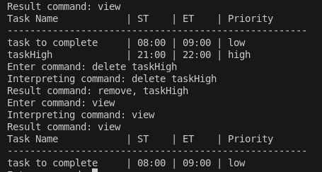

All the explanation and steps are in the spaceTasks folder 

Output screenshots for spaceTasks are as follows!!!

### Initial start of the application:- 

###  Help command:- 

(complete help can be found in the name of helpText.txt)

###  Interpreting commands (example with create):-
Here we are using "a taskName 2:00 3:00 low" 
a corresponds to 'add' (create) as per help text. 
So the interpreted command will have 'create' as the action name

###  Time conflict detection (using singleton time manager):- 
Whenever we create / update / unarchive a task - we check if there are conflicts (i.e. if there is free time)
Now, when we create, another schedule for 2:30 - we will get conflict

###  Add command without priority (no input given for it):- 
default value is assumed to be medium. (from interpretor)

###  adding a task with priority with h (high):- 

###  Task name conflict using observer:- 

###  View command:- (we can use list/v/l too)

Here it is important to observe that IT SORTED BASED ON THE TIME, irrepsective of how it was added. 

###  view command with priority filter:-

###  Marking tasks as done:-

here we are using done/archive to mark tasks as complete 
as we see here, when we have marked a task complete, it doesnt reflect in the view command (pending tasks)
It is only visible in the "ld" command where we list completed tasks. 

### Listing all completed tasks (ld):- 

###  Undoing tasks that were marked as done:-

when we undo a task, it is again added to list of todos (visible with view)

###  Time conflict when undoing tasks:- 

###  Deleting a task entirely (cannot retrive):- (can use delete/d/remove/r)

###  Editing a task - task name (using n):- 

